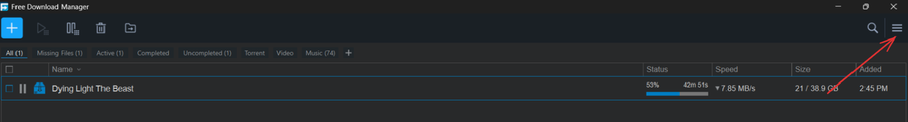
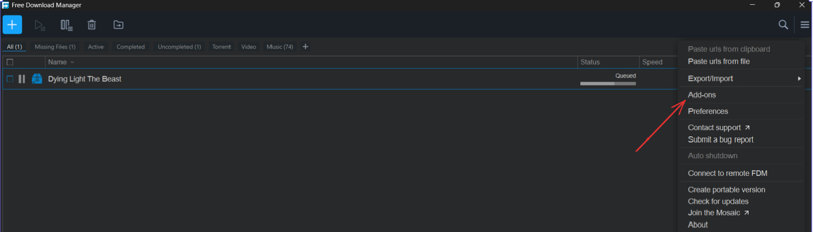
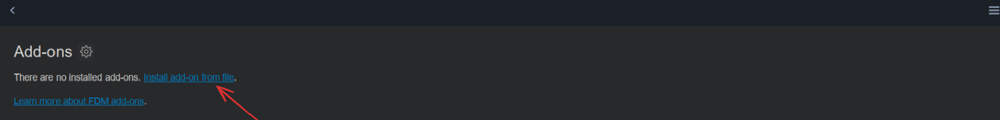
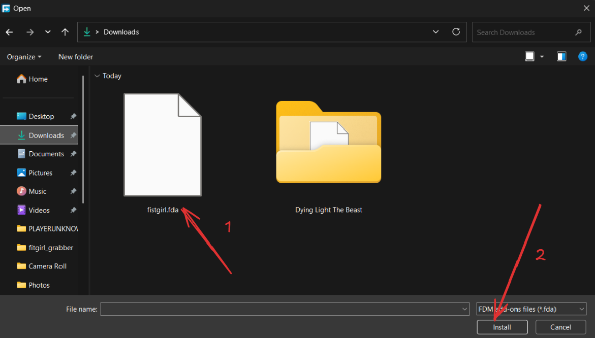
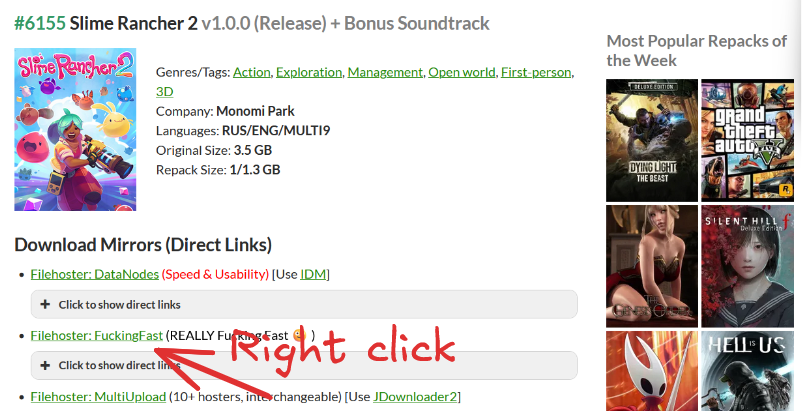
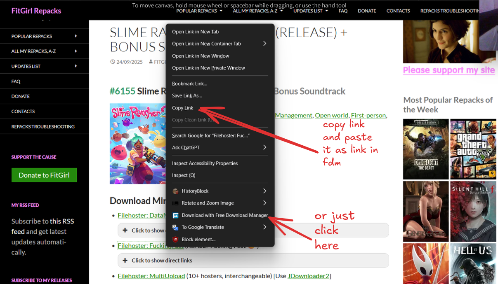
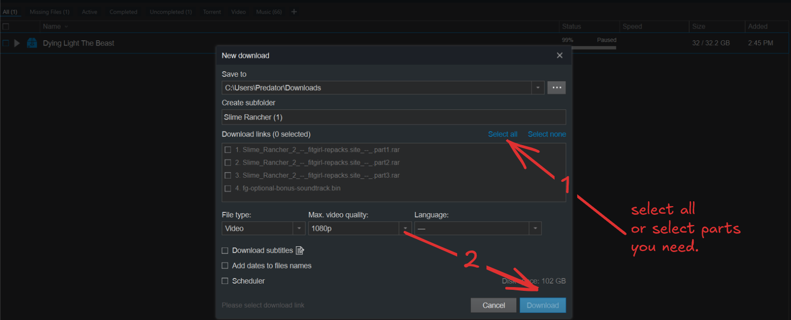

<center>
  <h1 style="margin-bottom: 1px;">Fistgirl</h1>
  
  <p></p>
</center>


Fistgirl is Free Download Manager (FDM) add-on that enables seamless downloading from FitGirl Repacks paste links. This add-on automatically extracts and processes download links from `paste.fitgirl-repacks.site` URLs, making it easy to download game repacks directly through FDM.
## Installation
1. Download the add-on(fistgirl.fda)

<center>
<a href="https://github.com/sagarchaulagai/fistgirl/releases/download/v1.0.0/fistgirl.fda">
    
  </a>
</center>

2. Open Free Download manager
3. Click hamburger menu button ☰

4. Click on Add-ons

5. Click on install add-on from file.

6. Select the downloaded add-on(fistgirl.fda) and install it

8. Fistgirl FDM addon is successfully added. 

## Usage
1. Go to your favourite game
2. Right click on `Filehoster: FuckingFast` link and copy it. 

3. Copy link and paste it on fdm or click on Download with FDM

4. Wait for the add-on to process the links and select files and start downloading



## Features

- **Automatic Link Extraction**: Parses FitGirl paste URLs and extracts all download links
- **Decryption Support**: Handles encrypted paste content using external decryption API
- **Batch Processing**: Processes multiple download links from a single paste
- **Smart Filtering**: Validates and filters URLs to ensure only valid download links are processed
- **Game Title Detection**: Automatically extracts game titles from URLs for better organization
- **Error Handling**: Comprehensive error handling with detailed logging


## Supported URLs

This add-on supports URLs matching the pattern:
```
https://paste.fitgirl-repacks.site/?[parameters]#[key]
```
Also, only ```fuckingfast.co``` is supported for now. I will add more supports if this addon get good response. 

## Technical Details

### Components

- **`parser.js`**: Main parser that handles paste decryption and link extraction
- **`msparser.js`**: Secondary parser for processing individual download links
- **`manifest.json`**: add-on configuration and metadata
- **`icon.svg`**: add-on icon


### Link Processing

1. **URL Validation**: Checks if the URL matches FitGirl paste format
2. **Parameter Extraction**: Extracts paste ID and decryption key from URL
3. **Content Decryption**: Uses external API to decrypt paste content
4. **Link Extraction**: Finds all `fuckingfast.co` download links
5. **Validation & Filtering**: Validates URLs and creates download entries
6. **Playlist Creation**: Organizes links into a downloadable playlist

## Configuration

The add-on includes several configurable parameters:

- **Query Interval**: Minimum 300ms between downloads (configured in `minIntevalBetweenQueryInfoDownloads`)
- **Response Size Limit**: 1MB limit for decrypted content to prevent memory issues
- **Link Limit**: Maximum 200 links per paste to prevent overwhelming FDM
- **Priority**: Highest priority (0x7FFFFFFF) for FitGirl URLs

## Troubleshooting

1. **"Invalid JSON from server"**: The paste URL may be malformed or the paste may be corrupted
2. **"Failed to decrypt paste"**: The decryption key in the URL may be incorrect or the external API may be unavailable
3. **"No links found"**: The paste may not contain any download links or they may be in an unexpected format


## Contributing

Contributions are welcome! Please feel free to submit issues, feature requests, or pull requests.

### Development Setup

1. Clone the repository
2. Make your changes to the JavaScript files
3. Test with FDM by copying to the add-ons directory
4. Submit a pull request with your improvements

## License

This project is licensed under the MIT License - see the [LICENSE](LICENSE) file for details.

## Disclaimer

This add-on is for educational purposes and to facilitate legitimate downloads. Please respect copyright laws and only download content you have the right to access. The authors are not responsible for any misuse of this software.

